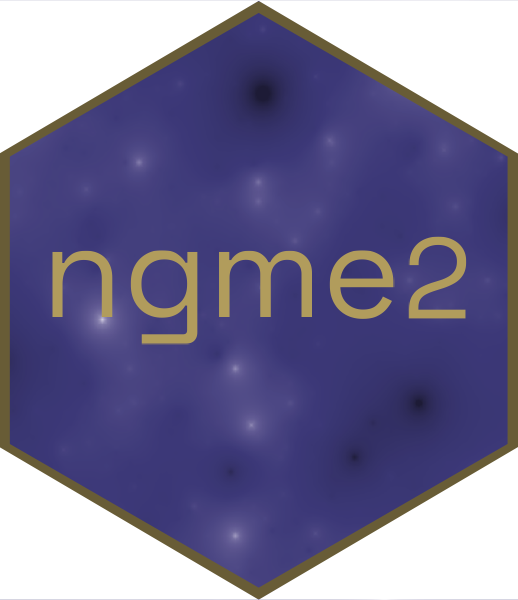

# The `ngme2` Package  

`ngme2` is a unified, efficient, and flexible framework for fitting latent **non-Gaussian** models in R. It extends the SPDE-based Gaussian modeling toolkit to handle skewness, heavy tails, and non-smooth behavior while keeping familiar workflows for estimation, prediction, and model assessment.

## What you get
- Temporal processes: AR(1), Ornstein–Uhlenbeck, random walks.
- Spatial processes: Matérn fields (including graph-based meshes) and separable/non-separable space–time variants.
- Non-Gaussian driven noise: NIG, generalized asymmetric Laplace, skew-\(t\); non-Gaussian measurement noise is also supported.
- Joint and custom structures: bivariate type-G fields, longitudinal random-effects models, and user-defined operators via `generic` / `generic_ns`.
- Practical tools: kriging-style prediction, cross-validation helpers, and diagnostics for convergence/fit quality.

## Model framework in a sentence
Data \(Y\) are linked to a latent process \(W\) through an observation matrix \(A\) and fixed effects \(X\beta\), while both the process and measurement errors are modeled as normal mean–variance mixtures with generalized inverse Gaussian mixing. An operator \(K(\theta)\) encodes spatial/temporal structure, letting the same template describe everything from simple random effects to rich spatio-temporal fields.

## Quick start
```r
library(ngme2)

fit <- ngme(
  formula = Y ~ x1 + x2 + f(index, model = ar1(mesh_1d), noise = noise_nig()),
  data    = data.frame(Y = Y, x1 = x1, x2 = x2, index = index),
  noise   = noise_normal()   # measurement noise
)
```
Use `ngme_optimizers()` to see available optimizers and configure stochastic gradient settings via `control_opt`.

## Installation
The stable version can be installed with:
```r
install.packages("ngme2", repos = "https://davidbolin.github.io/ngme2/")
```
See the [Installation and Configuration][install] vignette if compilation tools are needed.

## Learn more
- `vignette("ngme2")` for a guided tour of the modeling framework.
- `vignette("pred-and-est")` for estimation and prediction details.
- `vignette("cross-validation")` for model comparison workflows.

[install]: https://davidbolin.github.io/ngme2/articles/Installation_and_configuration.html "Installation and Configuration"
